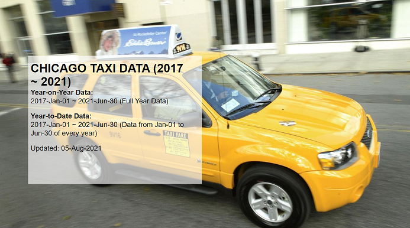

**Welcome to my data science portfolio.**
This portfolio contains my work on data science on Kaggle, or for my other courses and job interviews.

## Gesture Recognition using a 3D CNN or a CNN/RNN layer.

_Published: 13th-Jul-2022_

_Updated: 13th-Jul-2022_

This project aims to build a 3D CNN or a CNN/RNN in order to perform gesture recognition on video data (but in this case, video data are being reformatted into moving, still pictures). Best results was achieved when transfer learning was used in which GRU model was built on top of Google Inception v3 was being used.

[Link to Github repository](https://github.com/bengcheo/gesture_recognition)

.

## Detecting Melanoma through a CNN model.

_Published: 15th-Jun-2022_

_Updated: 15th-Jun-202_

This project aims to build a CNN model which uses photographs of moles and different types of skin pigmentations to identify melanoma. Melanoma is a type of cancer that can be deadly if not detected early. It accounts for 75% of skin cancer deaths. Three CNN models were being developed and class was rebalanced to achieve greater recall scores.

[Link to Github repository](https://github.com/bengcheo/skin_cancer_detection)

.

## Predicing House Prices in Australia

_Published: 6th-Apr-2022_

_Updated: 6th-Apr-2022_

Surprise Housing is looking to invest in the Australian market, but being new to Australia, does not know which variables are significant in predicting the price of a house, and how well those variables describe the price of a house. Model used was a Multivariate Logistics Regression with Lasso Regularization.

[Link to Github repository](https://github.com/bengcheo/housingprices)

.

## Bike Sharing in the United States

_Published: 8th-Feb-2022_

_Updated: 8th-Feb-2022_

This project aims to help US bike-sharing company, BoomBikes, identify the factors (variables) affect the demand of shared bikes in the US market. The aims of this project is to identify the variables which are significant in predicting the demand for shared bikes, and how well do these variables describe the bike demand for BoomBikes.

[Link to Github repository](https://github.com/bengcheo/bikesharing)

.

## Lending Club EDA

_Published: 5th-Jan-2022_

_Updated: 5th-Jan-2022_

In this case study which only utilizes Exploratory Data Analysis to identify common types of risks found in consumer finance companies lending loans:
If the applicant is likely to repay the loan, then not approving the loan results in a loss of business to the company, and if the applicant is not likely to repay the loan, i.e. he/she is likely to default, then approving the loan may lead to a financial loss for the company

[Link to Github repository](https://github.com/bengcheo/lendingclub)

.

## Latent Dirichlet allocation on job listings

_Published: 30th-Sept-2021_

_Updated: 30th-Sep-2021_

Believing that job listings all contains certain keywords which are specifically written for the profession, in this project, I attempted to use Latent Dirichlet allocation (LDA) to extract the common keywords and themes associated with each job listing, so that we can use an unsupervised approach in classifying each of the job listings into each various themes.

[Link to Github repository](https://github.com/bengcheo/NLP-Work/blob/main/Topic_Modelling_on_Job_Adverts.ipynb)

.

## Tableau Portfolio on taxi data in Chicago

_Published: 5th-Aug-2021_

_Updated: 5th-Aug-2021_

In this project, I used the open data base from Google BigQuery in which I analyzed the market share and market trend for taxi companies in Chicago, by comparing the yearly market share and trends of the individual taxi companies, and the impact of lockdown from the pandemic has had on the taxi companies. I have found the taxi companies have been merging to consolidate resources in these challenging times with much fewer companies today in Chicago than in previous years.

[Link to Tableau Public](https://public.tableau.com/app/profile/sebastian5987/viz/chicago_taxi_16276463455580/Story1?publish=yes)

.

## Real or Not NLP with Disaster Tweets

_Published: 21st-Mar-2020_

A Kaggle Data Science project in which I used feature engineering to pick out features, such as number of punctuation, sentence length etc., in order to build a model in which disaster and non-disaster tweets can be separated. Achieved a Training accuracy of 79% and a Test accuracy of 76% through the use of feature engineering.

[Link to Kaggle](https://www.kaggle.com/theyellowboots/real-or-not-nlp-with-disaster-tweets?scriptVersionId=30563775)

[Link to Github](https://github.com/bengcheo/Real-or-Not-NLP-with-disaster-tweets)

.

## Kaggle Competition Data Science for Good, City of Los Angeles

A Kaggle Data Science project in which we tried to find if the job listing contains any types of biasness. We first parsed the job listings into a dataframe before applying text analytics, in which we attempted to find which job listing contains more masculine words, and which job listing contains more feminine words.

[Link to Github](https://github.com/bengcheo/LetssaveLA)
