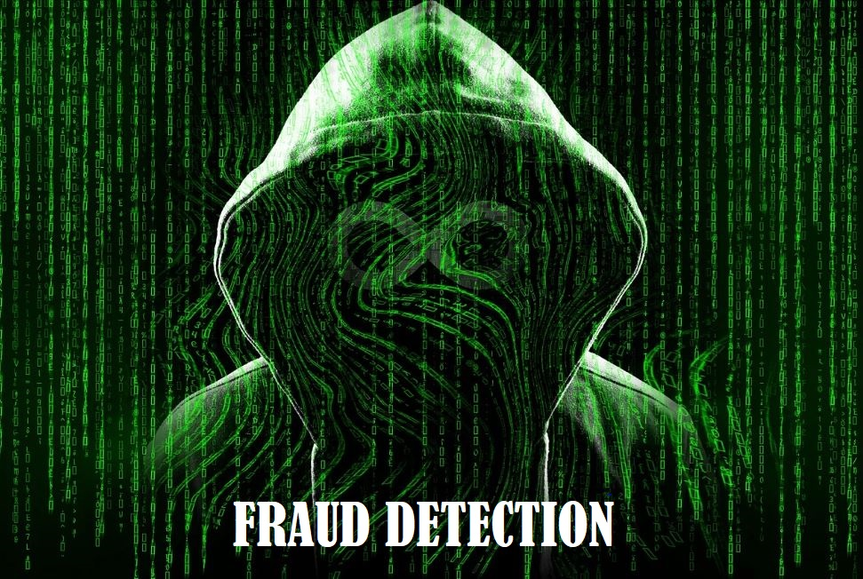

# Network, Data Center, LAN, WAN, SD-WAN and Data Science Portfolio
---
## Network, Data Center, LAN, WAN, SD-WAN Projects

### Internet Gateway and DC Setup and Designing Project

Fraud detection is a set of processes and analyses that allow businesses to identify and prevent unauthorized financial activity. This can include fraudulent credit card transactions, identify theft, cyber hacking, insurance scams, and more.

---
### Data Center VSS and Nexus setup and Network designing

Developing the network and Data Center architectural solutions and Leading the Data Network Team including the bill of materials, statement of work, LLD, HLD, and configuration templates that adhere to industry best practices, assisting with both Pre and Post Sales initiatives, helping clients identify and strategically implement multi-vendor solutions.

Deploy the Total Site Migration from old Notel environment like Passport 8600 ERS to Cisco 6800 & 6500 VSS and Nexus Platform, including the WAN Migrations from P2P link to MPLS and save cost. Also, Migrate Cisco LAN and WAN environments to Juniper LAN and SD-WAN/ WAN environments.

---
### Manage the Data Network Team in HLD (High-Level designs) & LLD (Low-Level designs) Design and Planning/testing

-	Lead and manage the Data Network Team in HLD (High-Level designs) & LLD (Low-Level designs) Design and Planning/testing.
-	Work with stakeholders to translate requirements and technical information into deliverable projects.
-	Handle project initiation by defining and documenting project scope, timeline, and budget.
-	Obtain project sponsors and identify stakeholders.
-	Develop /assess and select proper project strategy.
-	Take the lead in Design & planning: creating project schedules based on priorities, developers/QA, time/budget, project plans, and updating projects on a weekly development schedule.
-	Handle project execution and control, including leading launch meetings, plan execution,
-	controls, change management, managing expectations, and weekly performance reporting.
-	Complete the project closure process by ensuring compliance controls are updated upon project completion/release.
-	Work with operations team via resolving technology, systems, and information issues. Also, follow the different processes according to the ITIL standards.
-	Also analyze their common faults and problems from time to time and then plan it to make a proper Network design where required.
-	Design and implement change in VxLAN, vPC, FEX, VDC, etc on Nexus Platform (N7K, N5K, N2K) as per client requirements changes. Also, work on SD-WAN Design and deployment.
-	Design and implement Wireless Network with AP, and WLC as per client requirements.
-	Experienced with managing projects in diverse technology environments, with expertise in the design and enhancement of large-scale IP networks. Effective at translating business requirements into technical solutions, and developing strategies based on company objectives.
-	Extensive hands-on technology experience spanning multidisciplinary domains including routing and switching, security, wireless, data center, service provider, and cloud technologies.

---
# Machine learning

### Fraud Detection

Fraud detection protects customer and enterprise information, assets, accounts, and transactions through the real-time, near-real-time, or batch analysis of activities by users and other defined entities. Fraud Detection Using Machine Learning allows you to run automated transaction processing on an example dataset or your own dataset. The included ML model detects potentially fraudulent activity and flags that activity for review.

