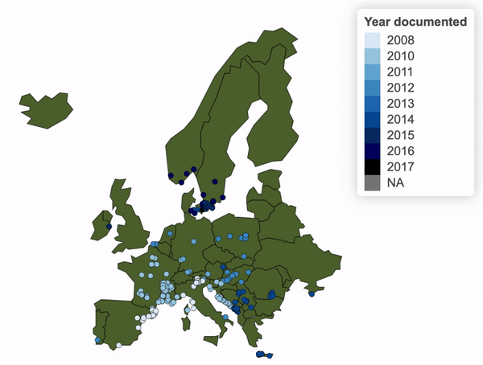
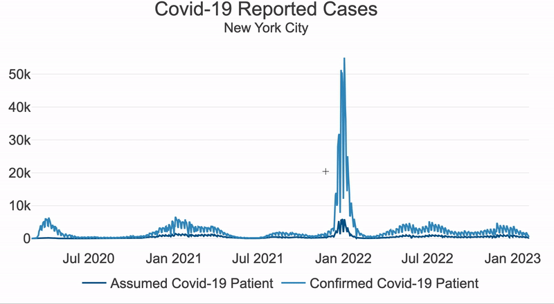

## Reporting Portfolio 

<h3 align="center"> <i>Drosophila suzukii</i> Global Distribution</h3>

 <i>D. suzukii</i> is an invasive fruit fly from Southeast Asia that lays it's eggs in ripe fruit, causing extensive crop damage. In 2018, scientists made a comprehensive overview of <i>D. suzukii's</i> global distribution [doi](https://doi.org/10.1111/1365-2664.13285). The compiled data is from over 500 documents and includes information on D. suzukii's ubiquity. 

         

 I used this data to visualize the progression of <i>D. suzukii</i>. Each dot is a recorded <i>D. suzukii</i> observation. Country names can be viewed when hovering. Labels for <i>D. suzukii's</i> obersvation date and abundance can be viewed when clicking on an individual dot. 

         

Interestingly, in Europe, <i>D. suzukii</i> progressed from the south to the north. This could indicate that <i>D. suzukii</i> invaded through southern ports and moved north on land.

<h3 align="center"> Three Years of COVID-19 in New York City</h3>
In the beginning of 2020, a new virus (SARS-CoV-2) spread worldwide causing a global pandemic. COVID-19, the disease caused by SARS-CoV-2, quickly dispersed through New York City (nyc). To make informed public health decisions, New York City tracked the case and death rate and publicized their data. I downloaded all the data from https://github.com/nychealth/coronavirus-data and creating the following figures. 

         

         
 

[Code example](/assets/img/R_code_for_suzukii_distribution.html)

         
 

 

         
 

