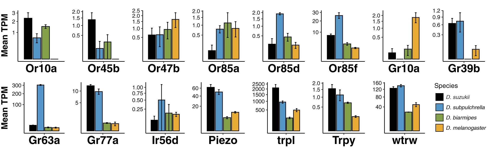
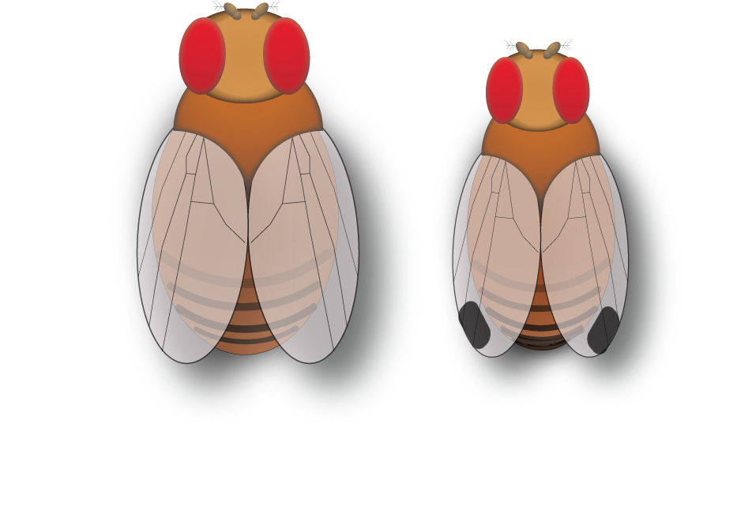
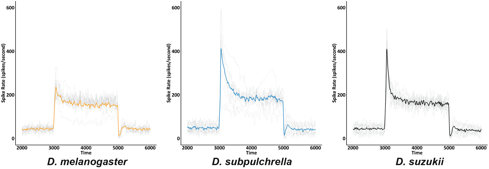

## Reporting Portfolio 

<h3 align="center"> <i>Drosophila suzukii</i> Global Distribution</h3>
<i>D. suzukii</i> is an invasive fruit fly from Southeast Asia that lays it's eggs in ripe fruit, causing extensive crop damage. In 2018, scientists made a comprehensive overview of <i>D. suzukii's</i> global distribution [Ørsted and  Ørsted, 2018](https://besjournals.onlinelibrary.wiley.com/doi/full/10.1111/1365-2664.13285). The compiled data is from over 500 documents and includes information on <i>D. suzukii's</i> ubiquity.

         

 I used this data to visualize the progression of <i>D. suzukii</i>. Each dot is a recorded <i>D. suzukii</i> observation. Country names can be viewed when hovering. Labels for <i>D. suzukii's</i> observation date and abundance can be viewed when clicking on an individual dot. 

         

Interestingly, in Europe, <i>D. suzukii</i> progressed from the south to the north. This could indicate that <i>D. suzukii</i> invaded through southern ports and moved north on land.

<h3 align="center"> Three Years of COVID-19 in New York City</h3>
In the beginning of 2020, a new virus (SARS-CoV-2) spread worldwide causing a global pandemic. COVID-19, the disease caused by SARS-CoV-2, quickly dispersed through New York City (NYC). To make informed public health decisions, NYC tracked the case and death rate and publicized their data. I downloaded all the data from [NYC - github](https://github.com/nychealth/coronavirus-data) and created the following figures. 

         

         
 

         
 

 

         
 

---

## Selected graphics from PH.D. thesis project
For the below graphic, I plotted the expression (TPM) of 15 genes of interest that were significantly differentially expressed in my RNA-sequencing analysis. For the analysis, I compared the expression rate (how often a gene is transcribed) of different genes between four fly species. 

         
 

Fly icons made for my thesis project. 

         
 

Below, I plotted the spike rate of one neuron that I recorded using single sensillum electrophysiology over time. Neurons spike when they receive an external signal, and the spike rate can be recorded using electrophysiology. Each trace shows one fly neuron spiking, and the bold colored line is the average of all traces. 
 

         
 

---
## Code examples 
- [D. suzukii distribution R code](/assets/img/R_code_for_suzukii_distribution.html) 
- [COVID-19 NYC R code](assets/img/R_code_for_covid_nyc.html)