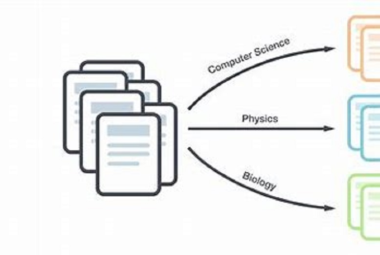
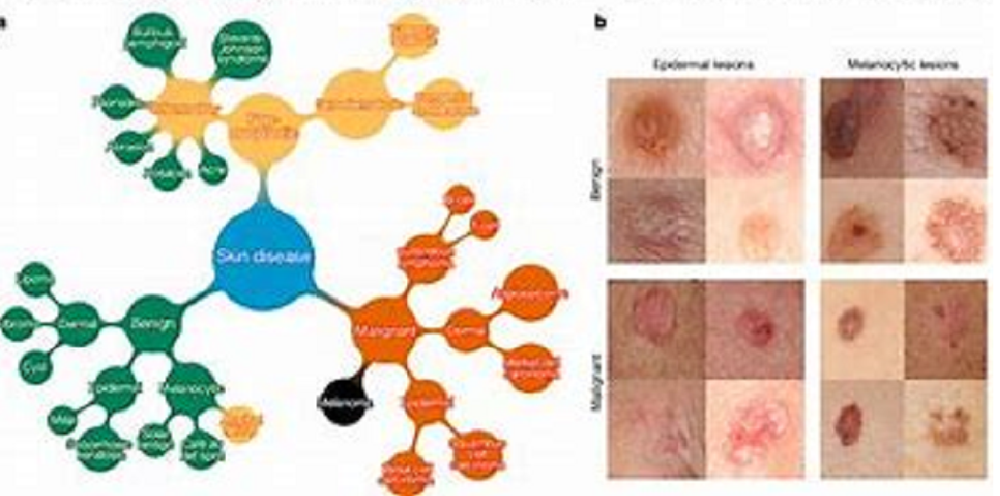

# Data Science Portfolio
---
## Machine learning
---
### Bike Sharing Analysis using Linear Regression
Domain: Transportation | Tech Stack: Python (ML model-Linear Regression)

A US bike-sharing provider ‘BoomBikes’ has suffered considerable dips in their revenues due to the ongoing Corona pandemic. ‘BoomBikes’ aspires to understand the demand for shared bikes among the people after this ongoing quarantine situation ends across the nation due to COVID-19. Therefore, they want to understand the factors affecting the demand for these shared bikes in the American market.

The company wants to know:

Which variables are significant in predicting the demand for shared bikes? 

How well do those variables describe the bike demands?

Business Goal:

Required to model the demand for shared bikes with the available independent variables. The management will use it to understand how exactly the needs vary with different features. So, they can manipulate the business strategy to meet the demand levels and meet the customer's expectations as well as the model will be a good way for the management to understand the demand dynamics of a new market.

[](https://github.com/Pieush-DS/DS_Projects/tree/main/Pieush_Bike_Sharing_Case_Study)

<center></center>

---
### Telecomm Churn Case Study
Domain: Telecomm | Tech Stack: Python (ML model-Logistic Regression)

The Telecomm industry is highly competitive and customers actively switch from one operator to another, the telecommunications industry experiences an average of 15-25% annual churn rate and it costs 5-10 times more to acquire a new customer than to retain an existing one, customer retention has now become even more important than customer acquisition.

Therefore in this project...

A) Need to analyze customer-level data of a leading telecom firm, build predictive models to identify customers at high risk of churn, and identify the main indicators of churn.

B) Need to define high-value customers based on a certain metric (mentioned later below) and predict churn only on high-value customers.

C) Use the usage-based definition to define churn.

[](https://github.com/Pieush-DS/DS_Projects/tree/main/Pieush_Telecomm_Churn_Case_Study)

<center></center>

---
### Lead Scoring Case Study-(Logistic Regression)
Domain: Education | Tech Stack: Python (ML model-Logistic Regression)

The company markets its courses on several websites and search engines like Google. Once these people land on the website, they might browse the courses fill up a form for the system, or watch some videos. When these people fill up a form providing their email address or phone number, they are classified as a lead. Moreover, the company also gets leads through past referrals. Once these leads are acquired, employees from the sales team start making calls, writing emails, etc. Through this process, some of the leads get converted while most do not. The typical lead conversion rate at X education is around 30%.
Now, although X Education gets a lot of leads, its lead conversion rate is inferior.

Business Goal:

Required to build a model wherein to assign a lead score to each of the leads such that the customers with higher lead scores have a higher conversion chance and the customers with lower lead scores have a lower conversion chance. The CEO has given a ballpark of the target lead conversion rate to be around 80%.

[](https://github.com/Pieush-DS/DS_Projects/tree/main/Pieush_Logistic%2BRegression%2B-%2BEducation%20Sells_Final)

<center></center>

---
### Advance Regression housing analysis for ‘Surprise Housing'
Domain: Housing | Tech Stack: Python (ML model-Advance Regression)

A US-based housing company named 'Surprise Housing' has decided to enter the Australian market. The company user data analytics to purchase houses at a price below their actual values and flip them on at a higher price. The company is looking at prospective properties to buy to enter the market, therefore required to build a model using regularisation to predict the actual value of the prospective properties and decide whether to invest in them or not.

[](https://github.com/Pieush-DS/DS_Projects/tree/main/Pieush_Advance_Regression_Housing)

<center></center>

---
### Credit Card Fraud Detection
Domain: Banking | Tech Stack: Python (ML)

Predict fraudulent credit card transactions with the help of Machine learning models. Analyse customer-level data that has been collected and analyzed during a research collaboration of Worldline and the Machine Learning Group. For many banks, retaining highly profitable customers is the number one business goal. Banking fraud, however, poses a significant threat to this goal for different banks. In terms of substantial financial losses, trust, and credibility, this is a concerning issue to both banks and customers alike.

[](https://github.com/Pieush-DS/DS_Projects/tree/main/P_Vyas_Credit%20Card%20Fraud%20Detection)

<center></center>

---
### Syntactic Processing (NLP)
Domain: Healthcare | Tech Stack: Python (NLP)

Companies like ‘BeHealthy’ are providing medical services, prescriptions, and online consultations and generating huge data day by day. To determine the disease name and its probable treatment from the dataset and list it out in the form of a table or a dictionary. 

[](https://github.com/Pieush-DS/DS_Projects/tree/main/Pieush_Syntatic%20Processing_Healthcare)

<center></center>

---
### Automatic Ticket Classification (NLP)
Domain: Customer Service | Tech Stack: Python (NLP-Topic Modelling)

Need to build a model that can classify customer complaints based on the products/services. By doing so, you can segregate these tickets into their relevant categories and, therefore, help in the quick resolution of the issue.

[](https://github.com/Pieush-DS/DS_Projects/tree/main/P_Vyas_Automatic_Ticket_Classification)

<center></center>

---
### Bike Sharing Analysis for Zulip (US-based startup)

Domain: Transportation | Tech Stack: SQL Lite, Tableau

Analyse about company’s geographical presence, trips between various locations, and average duration of trips.  
Zulip is running under a loss and has decided to shut operations for three of its stations. You have to use the data provided to help Zulip decide which three stations should be shut down.

[](https://github.com/Pieush-DS/DS_Projects/tree/main/Zulip%20Bike_Sharing_Analysis)

<center></center>

---
### Uber Car Rental Issue 
Domain: Transportation | Tech Stack: Python (EDA)

Issues regarding cancellation and non-availability of cabs for traveling to and from the airport during early morning cab bookings. This may impact the revenue generation of the company and issues faced by the customers.

Business Goal:
Identify the root cause of the problem (i.e. cancellation and non-availability of cars) and recommend ways to improve the situation of the Demand-Supply gap. So, the company can improve its revenue generation.

[](https://github.com/Pieush-DS/DS_Projects/tree/main/PVyas_Uber_Car_Rental_Analysis)

<center></center>

---
### Click Through Rate Prediction (ML Model selection)
Domain: Digital Marketing | Tech Stack: Python (ML model selection)

The objective is to predict whether the audience will click on an ad or not and thus help the marketing team answer ad placement-related questions.
In online advertising, CTR is a very important metric for evaluating ad performance. CTR prediction systems are thus essential and widely used for sponsored search and real-time bidding.

[](https://github.com/Pieush-DS/DS_Projects/tree/main/UOA_PVyas_CTR)

<center></center>

---
### Finance and Risk Analytics for Portfolio Management (Capstone)
Domain: Finance | Tech Stack: Python, Streamlit

The industry of wealth management has seen a lot of growth. Individuals and businesses actively seek maximum returns. However, in many cases, they lack either the skills to identify the right investment opportunities or the time to find such opportunities. This challenge gave rise to the dedicated individuals who perform this task on behalf of the investors for a commission: portfolio managers. A portfolio manager makes investment decisions and carries out other related activities on behalf of vested investors.	Help to understand stock's closing price, normalize closing price, daily returns, compare with other stocks, their distributions, and a few more parameters per the requirement of Portfolio Management. Provide consultation to two different investors, Mr. Patrick Jyenger and Mr. Peter Jyenger based on their requirements and financial objectives.

[](https://github.com/Pieush-DS/DS_Projects/tree/main/UOA_PVyas_CTR)

<center></center>

---
### Multiclass Classification model of Skin Cancer Detection using CNN in Tensorflow
Domain: Health | Tech Stack: Python (CNN in Tensorflow)

To build a CNN-based model that can accurately detect melanoma. Melanoma is a type of cancer that can be deadly if not detected early. It accounts for 75% of skin cancer deaths. A solution that can evaluate images and alert dermatologists about the presence of melanoma has the potential to reduce a lot of manual effort needed in diagnosis.

[](https://github.com/Pieush-DS/DS_Projects/tree/main/UOA_P_Vyas_CNN_Skin_Cancer)

<center></center>

---
### Identify Entities in Healthcare for ‘BeHealthy’ using NER (Named Entity Recognition) 
Domain: Health | Tech Stack: Python (NER)

Companies like ‘BeHealthy’ are providing medical services, prescriptions, and online consultations and generating huge data day by day. Therefore, to find out the disease and its probable treatment from the given dataset and store it in the form of a table or a dictionary is necessary to make it easier for non-medical background people. After analyzing the problem need to build a custom NER to get the list of diseases and their treatment from the data set.

[](https://github.com/Pieush-DS/DS_Projects/tree/main/UOA_P_Vyas_NER)

<center></center>

---
### Spanish to English Neural Machine Translation (NMT) Model building  
Domain: Insurance | Tech Stack: Python (ML-NMT)

Build an attention-based sequence-to-sequence model that can effectively understand the context of Spanish sentences and translate them into clear and coherent English sentences. The company aims to use this model to ensure seamless communication and provide coverage to the Spanish-speaking community in Mexico.
Objectives: To explore the challenges of working with low-resource languages. Implement an encoder-decoder NMT model with attention.
Terminal Objective: To build and train an NMT model that can accurately translate Spanish sentences to English and vice versa.

[](https://github.com/Pieush-DS/DS_Projects/tree/main/UOA_P_Vyas_Span_to_English_NMT)

<center></center>


<!-- 
---
layout: default
---
*/
Text can be **bold**, _italic_, or ~~strikethrough~~.

[Link to another page](./another-page.html).

There should be whitespace between paragraphs.

There should be whitespace between paragraphs. We recommend including a README, or a file with information about your project.

# Header 1

This is a normal paragraph following a header. GitHub is a code hosting platform for version control and collaboration. It lets you and others work together on projects from anywhere.

## Header 2

> This is a blockquote following a header.
>
> When something is important enough, you do it even if the odds are not in your favor.

### Header 3

```js
// Javascript code with syntax highlighting.
var fun = function lang(l) {
  dateformat.i18n = require('./lang/' + l)
  return true;
}
```

```ruby
# Ruby code with syntax highlighting
GitHubPages::Dependencies.gems.each do |gem, version|
  s.add_dependency(gem, "= #{version}")
end
```

#### Header 4

*   This is an unordered list following a header.
*   This is an unordered list following a header.
*   This is an unordered list following a header.

##### Header 5

1.  This is an ordered list following a header.
2.  This is an ordered list following a header.
3.  This is an ordered list following a header.

###### Header 6

| head1        | head two          | three |
|:-------------|:------------------|:------|
| ok           | good swedish fish | nice  |
| out of stock | good and plenty   | nice  |
| ok           | good `oreos`      | hmm   |
| ok           | good `zoute` drop | yumm  |

### There's a horizontal rule below this.

* * *

### Here is an unordered list:

*   Item foo
*   Item bar
*   Item baz
*   Item zip

### And an ordered list:

1.  Item one
1.  Item two
1.  Item three
1.  Item four

### And a nested list:

- level 1 item
  - level 2 item
  - level 2 item
    - level 3 item
    - level 3 item
- level 1 item
  - level 2 item
  - level 2 item
  - level 2 item
- level 1 item
  - level 2 item
  - level 2 item
- level 1 item

### Small image


### Large image


### Definition lists can be used with HTML syntax.

<dl>
<dt>Name</dt>
<dd>Godzilla</dd>
<dt>Born</dt>
<dd>1952</dd>
<dt>Birthplace</dt>
<dd>Japan</dd>
<dt>Color</dt>
<dd>Green</dd>
</dl>

```
Long, single-line code blocks should not wrap. They should horizontally scroll if they are too long. This line should be long enough to demonstrate this.
```

```
The final element.
```
-->
