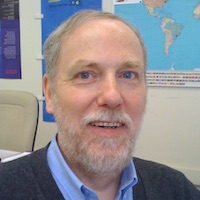
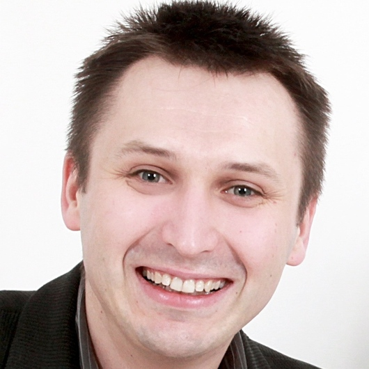

       
# About
        
The Disease Maps Project as a large-scale community effort was initiated by the <a href="http://wwwen.uni.lu/lcsb" target="_blank">Luxembourg Centre for Systems Biomedicine</a>, the <a href="http://www.eisbm.org/" target="_blank">European Institute for Systems Biology and Medicine</a> and the <a href="http://www.institut-curie.org/" target="_blank">Institut Curie</a>.

## Get involved

We are actively expanding the list of diseases covered by the Disease Maps Project and are looking for new contributors interested in molecular mechanisms of diseases: computational biology teams working on disease models and clinicians or experimental biologists who would like to contribute as domain experts. If you are working on one of the diseases which are already listed on this website, please do not be discouraged: we would be happy to collaborate and integrate your work in the overall effort.
        
## Principal Investigators

<table>
<tr>
<td style="width: 200px;">

</td>
<td style="width: 200px;">

</td>
<td style="width: 200px;">

</td>
</tr>
<tr>
<td style="width: 200px; text-align:left; vertical-align:top;"><strong>Charles Auffray, PhD</strong>
Research Director at CNRS, Founding Director of the European Institute for Systems Biology and Medicine, Lyon, France
</td>
<td style="width: 200px; text-align:left; vertical-align:top;"><strong>Reinhard Schneider, PhD</strong>
Head of Bioinformatics Core, Luxembourg Centre for Systems Biomedicine, University of Luxembourg, Luxembourg
</td>
<td style="width: 200px; text-align:left; vertical-align:top;"><strong>Emmanuel Barillot, PhD</strong>
Director of the U900 Institut Curie/INSERM/Ecole des Mines ParisTech, Paris, France
</td>
</tr>
</table>
        
## Project Leaders

The leaders of the Disease Maps Project develop and refine the concept of disease maps, coordinate the activities of the community effort, help to initiate new maps, advise on best practices and offer guidelines.

<table>
<tr>
<td style="width: 200px;">

</td>
<td style="width: 200px;">

</td>
<td style="width: 200px;">

</td>
</tr>
<tr>
<td style="width: 200px; text-align:left; vertical-align:top;"><strong>Alexander Mazein, PhD</strong>
Researcher, Luxembourg Centre for Systems Biomedicine, University of Luxembourg, Belvaux, Luxembourg
</td>
<td style="width: 200px; text-align:left; vertical-align:top;"><strong>Marek Ostaszewski, PhD</strong>
Researcher, Luxembourg Centre for Systems Biomedicine, University of Luxembourg, Belvaux, Luxembourg
</td>
<td style="width: 200px; text-align:left; vertical-align:top;"><strong>Inna Kuperstein, PhD</strong>
ACSN Project Coordinator, Computational Systems Biology of Cancer group, Institut Curie, Paris, France
</td>
</tr>
</table>    

<!--### Project Coordinators
[Alexander Mazein](mailto:a.mazein@gmail.com), 
[Marek Ostaszewski](mailto:marek.ostaszewski@uni.lu), 
[Inna Kuperstein](mailto:inna.kuperstein@curie.fr), 
[Andrei Zinoviev](mailto:andrei.zinovyev@curie.fr), 
[Reinhard Schneider](mailto:reinhard.schneider@uni.lu), 
[Emmanuel Barillot](mailto:emmanuel.barillot@curie.fr), 
[Rudi Balling](mailto:rudi.balling@uni.lu), 
[Charles Auffray](mailto:cauffray@eisbm.org)-->
        
<!--### Scientific Advisory Board

The Scientific Advisory Board is composed of scientists with expertise in large-scale systems biology and translational medicine projects. The board provides guidance regarding the goals and the roadmap for the Disease Maps Project.

The list of the Scientific Advisory Board members is being confirmed.
-->

## Acknowledgements

We would like to thank Rudi Balling, the Director of the <a href="http://lcsb.uni.lu" target="_blank">Luxembourg Centre for Systems Biomedicine</a> for his longstanding and enthusiastic support to the concept of disease maps. He is one of the key people that helped to catalyse the Disease Maps Project.

Most of the published disease maps were developed in collaboration with the <a href="http://www.sbi.jp/" target="_blank">Systems Biology Institute</a>, Tokyo, Japan (Mizuno et al., 2012, <a href="https://www.ncbi.nlm.nih.gov/pubmed/22647208" target="_blank">PMID 22647208</a>; Matsuoka et al., 2013, <a href="https://www.ncbi.nlm.nih.gov/pubmed/24088197" target="_blank">PMID 24088197</a>; Fujita et al., 2014, <a href="https://www.ncbi.nlm.nih.gov/pubmed/23832570" target="_blank">PMID 23832570</a>; Kuperstein et al., 2015, <a href="https://www.ncbi.nlm.nih.gov/pubmed/26192618" target="_blank">PMID 26192618</a>). We would like to underline the role of Prof. Hiroaki Kitano in pioneering the process description representation of signalling networks and initiating first comprehensive disease-relevant extensive reconstructions of signalling pathways (Oda et al., 2005, <a href="https://www.ncbi.nlm.nih.gov/pubmed/16729045" target="_blank">PMID 16729045</a>; Oda and Kitano, 2006, <a href="https://www.ncbi.nlm.nih.gov/pubmed/16738560" target="_blank">PMID 16738560</a>; Caron et al., 2010, <a href="https://www.ncbi.nlm.nih.gov/pubmed/21179025" target="_blank">PMID 21179025</a>).

## Funding

The Disease Maps Project is funded in part by [IMI eTRIKS n°115446](http://www.imi.europa.eu/projects-results/project-factsheets/etriks)
([eTRIKS](https://www.etriks.org/), European Translational Information and Knowledge Management Services).
