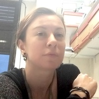

       
# About
        
The Disease Maps Project as a large-scale community effort was initiated by the <a href="http://wwwen.uni.lu/lcsb" target="_blank">Luxembourg Centre for Systems Biomedicine</a>, the <a href="http://www.eisbm.org/" target="_blank">European Institute for Systems Biology and Medicine</a> and the <a href="http://www.institut-curie.org/" target="_blank">Institut Curie</a>.

## Get involved

We are actively expanding the list of diseases covered by the Disease Maps Project and are looking for new contributors interested in molecular mechanisms of diseases: computational biology teams working on disease models and clinicians or experimental biologists who would like to contribute as domain experts. If you are working on one of the diseases which are already listed on this website, please do not be discouraged: we would be happy to collaborate and integrate your work in the overall effort.
        
## Principal Investigators

<table>
<tr>
<td style="width: 200px;">

</td>
<td style="width: 200px;">

</td>
<td style="width: 200px;">

</td>
</tr>
<tr>
<td style="width: 200px; text-align:left; vertical-align:top;"><strong>Charles Auffray, PhD</strong>
Research Director at CNRS, Founding Director of the European Institute for Systems Biology and Medicine, Lyon, France
</td>
<td style="width: 200px; text-align:left; vertical-align:top;"><strong>Reinhard Schneider, PhD</strong>
Head of Bioinformatics Core, Luxembourg Centre for Systems Biomedicine, University of Luxembourg, Belvaux, Luxembourg
</td>
<td style="width: 200px; text-align:left; vertical-align:top;"><strong>Emmanuel Barillot, PhD</strong>
Director of the U900 Institut Curie/INSERM/Ecole des Mines ParisTech, Paris, France
</td>
</tr>
</table>
        
## Project Leaders

The leaders of the Disease Maps Project develop and refine the concept of disease maps, coordinate the activities of the community effort, help to initiate new maps, advise on best practices and offer guidelines.

<table>
<tr>
<td style="width: 200px;">

</td>
<td style="width: 200px;">

</td>
<td style="width: 200px;">

</td>
</tr>
<tr>
<td style="width: 200px; text-align:left; vertical-align:top;"><strong>Alexander Mazein, PhD</strong>
Researcher, Luxembourg Centre for Systems Biomedicine, University of Luxembourg, Belvaux, Luxembourg
</td>
<td style="width: 200px; text-align:left; vertical-align:top;"><strong>Marek Ostaszewski, PhD</strong>
Researcher, Luxembourg Centre for Systems Biomedicine, University of Luxembourg, Belvaux, Luxembourg
</td>
<td style="width: 200px; text-align:left; vertical-align:top;"><strong>Inna Kuperstein, PhD</strong>
ACSN Project Coordinator, Computational Systems Biology of Cancer group, Institut Curie, Paris, France
</td>
</tr>
<tr>
<td style="width: 200px;">

</td>
<td style="width: 200px;"> </td>
<td style="width: 200px;"> </td>
</tr>
<tr>
<td style="width: 200px; text-align:left; vertical-align:top;"><strong>Anna Niarakis, PhD</strong>
Associate Professor, University of Evry, University of Paris-Saclay, Evry, France
</td>
<td style="width: 200px; text-align:left; vertical-align:top;"> </td>
<td style="width: 200px; text-align:left; vertical-align:top;"> </td>
</tr>
</table>    

<!--### Project Coordinators
[Alexander Mazein](mailto:a.mazein@gmail.com), 
[Marek Ostaszewski](mailto:marek.ostaszewski@uni.lu), 
[Inna Kuperstein](mailto:inna.kuperstein@curie.fr), 
[Andrei Zinoviev](mailto:andrei.zinovyev@curie.fr), 
[Reinhard Schneider](mailto:reinhard.schneider@uni.lu), 
[Emmanuel Barillot](mailto:emmanuel.barillot@curie.fr), 
[Rudi Balling](mailto:rudi.balling@uni.lu), 
[Charles Auffray](mailto:cauffray@eisbm.org)-->
        
<!--### Scientific Advisory Board

The Scientific Advisory Board is composed of scientists with expertise in large-scale systems biology and translational medicine projects. The board provides guidance regarding the goals and the roadmap for the Disease Maps Project.

The list of the Scientific Advisory Board members is being confirmed.
-->

## Acknowledgements

We would like to thank Rudi Balling, the Director of the <a href="http://lcsb.uni.lu" target="_blank">Luxembourg Centre for Systems Biomedicine</a> for his longstanding and enthusiastic support to the concept of disease maps. He is one of the key people that helped to catalyse the Disease Maps Project.

Many published disease maps were developed in collaboration with the <a href="http://www.sbi.jp/" target="_blank">Systems Biology Institute</a>, Tokyo, Japan (Mizuno et al., 2012, <a href="https://www.ncbi.nlm.nih.gov/pubmed/22647208" target="_blank">PMID 22647208</a>; Matsuoka et al., 2013, <a href="https://www.ncbi.nlm.nih.gov/pubmed/24088197" target="_blank">PMID 24088197</a>; Fujita et al., 2014, <a href="https://www.ncbi.nlm.nih.gov/pubmed/23832570" target="_blank">PMID 23832570</a>; Kuperstein et al., 2015, <a href="https://www.ncbi.nlm.nih.gov/pubmed/26192618" target="_blank">PMID 26192618</a>). We would like to underline the role of Prof. Hiroaki Kitano in pioneering the process description representation of signalling networks and initiating first comprehensive disease-relevant extensive reconstructions of signalling pathways (Oda et al., 2005, <a href="https://www.ncbi.nlm.nih.gov/pubmed/16729045" target="_blank">PMID 16729045</a>; Oda and Kitano, 2006, <a href="https://www.ncbi.nlm.nih.gov/pubmed/16738560" target="_blank">PMID 16738560</a>; Caron et al., 2010, <a href="https://www.ncbi.nlm.nih.gov/pubmed/21179025" target="_blank">PMID 21179025</a>).

## Funding

The Disease Maps Project was funded in part by [IMI eTRIKS n°115446](http://www.imi.europa.eu/projects-results/project-factsheets/etriks) ([eTRIKS](https://www.etriks.org/), European Translational Information and Knowledge Management Services).

The Parkinson’s Disease Map is funded by the <a href="http://wwwen.uni.lu/lcsb" target="_blank">Luxembourg Centre for Systems Biomedicine</a> (LCSB): Institutional Funds and supported by a donation from <a href="http://www.oeuvre.lu/" target="_blank">L’ Œuvre Nationale de Secours Grande-Duchesse Charlotte</a>.  
 
The Atlas of Cancer Signalling Network is supported by the COMeT grant from <a href="https://itcancer.aviesan.fr/" target="_blank">ITMO Cancer</a> (Call Systems Biology 2014, Immunology maps); <a href="http://www.curie.fr/" target="_blank">Institut Curie</a> (U900 budget).<a href="http://www.inserm.fr/" target="_blank">INSERM</a> (U900 budget); <a href="http://www.ligue-cancer.net/" target="_blank">Ligue Nationale Contre le Cancer</a> (Equipe labellisée); <a href="http://www.agilent.com/" target="_blank">Agilent</a> Thought Leader Award #3273; the grant “Projet Incitatif et Collaboratif Computational Systems Biology Approach for Cancer” from <a href="http://www.curie.fr/" target="_blank">Institut Curie</a> (DNA repair map); <a href="http://www.servier.fr/" target="_blank">Servier</a> - Institut Curie Alliance (DNA repair map); INVADE grant from ITMO Cancer (Call Systems Biology 2012, EMT and Cell Motility map); <a href="http://www.e-cancer.fr/en" target="_blank">INCA</a> LABEL Cancéropole Ile-de-France 2011-1-LABEL-1 grant; <a href="http://www.ucd.ie/sbi/asset/" target="_blank">ASSET</a> EU FP7 project under grant agreement n° FP7-HEALTH-2010-259348; APO-SYS EU FP7 project under grant agreement n° HEALTH-F4-2007-200767 (Apoptosis map).  
 
The Rheumatoid Arthritis Map is developed within PhD project "Integrative Modelling and Analysis of Molecular Pathways dysregulated in Rheumatoid Arthritis" is funded by the <a href="https://www.universite-paris-saclay.fr/en/node/7231#l-ecole-doctorale" target="_blank">Doctoral School "Structure and Dynamics of Living Systems"</a>, the <a href="https://www.universite-paris-saclay.fr/en" target="_blank">University of Paris-Saclay</a>. It was supported by the <a href="https://www.casym.eu/blog/category/casym-research-exchange-grants/" target="_blank">CASyM research exchange grant</a>, 2015. Awarded project: “Building a unified pathway theory of inflammation across asthma, rheumatoid arthritis and atherosclerosis”. 

The AsthmaMap project is funded in part by the Innovative Medicines Initiative (IMI) funded by the European Union and the European Federation of Pharmaceutical Industry Associations through [U-BIOPRED](https://www.europeanlung.org/en/projects-and-research/projects/u-biopred/home) (Unbiased Biomarkers for the Prediction of Respiratory Disease Outcomes, n°115010) and [eTRIKS](https://www.etriks.org/) (European Translational Information and Knowledge Management Services, IMI n°115446), the French National Center for Scientific Research (CNRS), the European Institute for Systems Biology and Medicine and the Luxembourg Center for Systems Biomedicine.  

The Cystic Fibrosis Map is supported by the [Fundação para a Ciência e a Tecnologia](https://www.fct.pt/) through the PhD Grant ref. PD/BD/131405/2017.  

The Atherosclerosis Map was supported by European Union Regional Development Fund (ERDF) EU Sustainable Competitiveness Programme for N. Ire- land; the Northern Ireland Public Health Agency (Health and Social Care R&D); Ulster University [all to Professor Tony Bjourson]; and Microsoft Azure Research [CRM:0740357 to SW].  

The Multiple Sclerosis Map is being built on the network developed by Marti Bernardo in the context of the 7FP EU CombiMS project, with an input from 7FP EU <a href="http://www.combims.eu/" target="_blank">CombiMS</a> consortium members (Saez-Rodriguez et al., PLoS Comput Biol, 2007, PMID <a href="https://www.ncbi.nlm.nih.gov/pubmed/17722974" target="_blank">17722974</a>). The network is currently being further refined and extended by Melanie Rinas at the Saez-Rodriguez group in the context of the EraSysMed Sys4MS project.  

The Cognitive Resilience Map is supported by the Helmholtz Network of Excellence.  

The Anathylaxis Map development is supported by [MESR](http://www.mesr.public.lu) and [FNR](http://www.fnr.lu).  

The Meniere’s Disease Map is a project initiated as part of MD-CONNECT project funded by the [FNR INTER Mobility](https://www.fnr.lu/funding-instruments/inter-mobility/) and the Andalusian Health Department.  

The Lung Disease Map is supported by the regional cancer organisation [Canceropole Lyon Auvergne Rhone Alpes](http://www.canceropole-clara.com/) (CLARA).  

