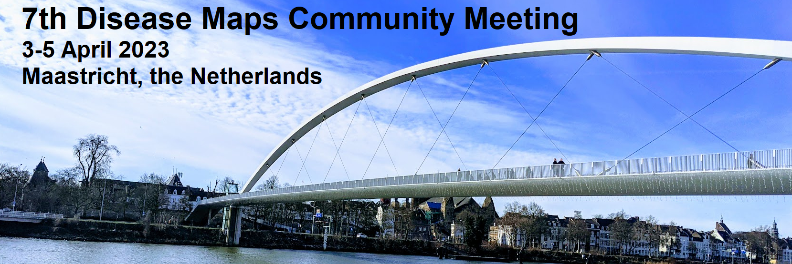

The 2023 community meeting is hosted at <a target="_blank" href="https://www.maastrichtuniversity.nl/">**Maastricht University**</a> by the Maastricht Centre for Systems Biology (MaCSBio) and the Department of Bioinformatics (BiGCaT).  
The theme of this year's meeting will be **"The Disease Maps Alliance: Bringing Experts Together"** focusing on the challenges of community building in systems biology and systems biomedicine. 

## Date / Location

**3-5 April 2023 in Maastricht**, the Netherlands

**Address:** 
Universiteitssingel 40 
6229 ER Maastricht 
[Google Maps](https://www.google.nl/maps/place/Universiteitssingel+40,+6229+Maastricht/@50.836875,5.7125936,17z/data=!4m5!3m4!1s0x47c0e9846f102435:0x86d4627c2038d3d9!8m2!3d50.8368276!4d5.7166706)

## Programme

- Detailed <a href="/DMCM2023/Program" target="_blank">schedule.</a>
- List of <a href="/DMCM2023/Posters" target="_blank">poster</a>
- List of <a href="/DMCM2023/Participants" target="_blank">participants</a>

## Registration and Abstract submission

The registration is free but mandatory for all presenters and attendees. 
<a target="_blank" href="https://maastrichtuniversity.eu.qualtrics.com/jfe/form/SV_7aqKW2pPf7b6rJ4"><u>Register before 24 March 2023.</u></a>

<b>Abstract submission</b>: <a target="_blank" href="https://easychair.org/conferences/?conf=dmcm2023"><u>EasyChair</u></a> 
Simple abstract (only text) - max. 300 words.

* Deadline for talks and tutorials: ~~**3 March 2023**~~ 🛑 **New deadline: 10 March 2023** 🛑
* Deadline for posters: **24 March 2023**
  

## General information

**Travel** 
You can find more information about travel by plane, train, bus, or car <a target="_blank" href="https://www.visitmaastricht.com/accessibility">here</a>. 

**Hotels** 
There are many <a target="_blank" href="https://www.visitmaastricht.com/overnight-stays/hotels">hotels in Maastricht</a> and many of them are either in walking distance or a short bus or bike ride from the conference location.  
There are two hotels next to the conference location who offered to reserve some rooms:
* <a target="_blank" href="https://www.nh-hotels.nl/hotel/nh-maastricht">NH Hotel Randwyck</a> - book by email with code "UM MACSBIO" (nhmaastricht@nh-hotels.com) - special price per night (2.Apr. = 88.90 EUR, 3.Apr = 94.90 EUR, 4.Apr = 111.90 EUR, 5.Apr = 103.90 EUR) - price incl. breakfast.
* <a target="_blank" href="https://www.aparthotelrandwyck.nl/en/">Apart Hotel Randwyck</a> - book by email with code "UM2023" (info@aparthotelrandwyck.nl) - 84 EUR excl. breakfast per night

## Keynote speakers

We are excited to announce the following keynote speakers for our upcoming event:

<table>
  <tr>
    <td></td>
    <td> <a href="https://www.ebi.ac.uk/people/person/sandra-orchard/" target="_blank"><b>Keynote 1: Sandra Orchard</b></a> <b>Talk Title: Is expert biocuration still relevant in this day of machine-learning?</b> Sandra Orchard is Team Leader for Protein Function Content, with a strong background in protein annotation. Her team is primarily responsible for the curation of UniProt at EMBL-EBI, annotation of the Gene Ontology and contribute to value-added protein information resources such as the Complex Portal. Sandra and her team support professional training in data resources for exploring protein function, sequence analysis, interactions and pathways. She is a former Chair of the Executive Committee of the International Society for Biocuration and is currently Chair of the Human Proteome Organisation Poteomics Standards Initiative. </td>
  </tr> 
  <tr>
    <td></td>
    <td> <a href="https://www.sib.swiss/patrick-ruch-group" target="_blank"><b>Keynote 2 Patrick Ruch</b></a> <b>Talk Title: Literature Text Mining from Information Retrieval to Curation Support</b> Patrick Ruch is professor at HES-SO Geneva and group leader at SIB Swiss Institute of Bioinformatics, where he leads the SIB Text Mining group. His research at SIB focuses on developping text and data mining solutions to support biocuration tasks, such as information retrival, literature triage or named-entity recognition. In parallel, the research group at the HES-SO university is also performing research on clinical contents with direct applications in oncology and rare disease; thus developping original language models based on transformers and distillation infrastructure. More recently, he has been exploring how Open Access libraries such as PMC could be enhanced to include Biodiversity related articles with the aim to achieve the WHO's vision of a One Health data hub.</td>
  </tr> 
    <tr>
    <td width="150"></td>
    <td> <a href="https://www.maastrichtuniversity.nl/chris.evelo" target="_blank"><b>Keynote 3: Chris Evelo</b></a> <b>Talk Title: TBA</b> </td>
  </tr>
</table>

## Funding

This conference is funded by ZonMw as part of the WikiPathways COVID-19 project (nr: [10430012010015](https://www.zonmw.nl/nl/over-zonmw/coronavirus/programmas/project-detail/covid-19-programma/wikipathways-as-a-platform-for-covid-19-biological-pathway-models/)). 

## Organisers

### Local organisers

<a href="mailto:martina.kutmon@maastrichtuniversity.nl">Martina Summer-Kutmon</a>
 Friederike Ehrhart
 Hasan Balci
 Isabel Wassink

### Disease Maps Project Coordinators

<a href="mailto:a.mazein@gmail.com">Alexander Mazein</a>
 <a href="mailto:marek.ostaszewski@uni.lu">Marek Ostaszewski</a>
 <a href="mailto:inna.kuperstein@curie.fr">Inna Kuperstein</a>
 <a href="mailto:anna.niaraki@univ-evry.fr">Anna Niarakis</a>

<!--## Contact-->

<!--## Co-organizers-->
