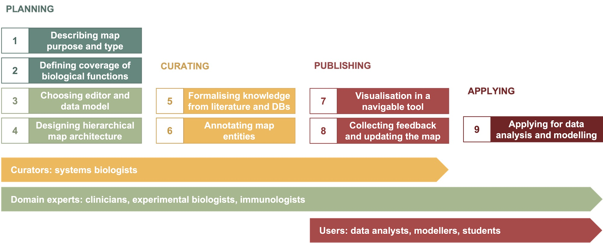

# Guidelines

&#8594; [Designing map architecture](../architecture)   
&rarr; [Annotation](../annotation)  

&#8618;	[Designing map architecture](../architecture)  
&#8618;	[Annotation](../annotation)  

&#8627;	[Designing map architecture](../architecture)  
&#8627;	[Annotation](../annotation)  

The provided guidelines are based on our collective experience of building representations of disease mechanisms, the work by Maria Kondratova and coauthors (Kondratova et al., 2018, [PMID:29688383](https://pubmed.ncbi.nlm.nih.gov/29688383/)), descriptions of [published disease maps](https://disease-maps.org/publications#disease-maps) and [comprehensive pathway maps](/publications#comprehensive-pathway-maps).  

In each case, a resource is designed while taking into account the goals and objectives of a particular project, specifics of disease conditions and disease subtypes.  

### Disease map development workflow

The development workflow consists of nine steps in four phases: planning, curation, publishing and application.

**Figure 1.** The map development workflow.  

PLANNING AND DESIGN  
&nbsp; &nbsp; &nbsp; 1. Determining map purpose and type  
&nbsp; &nbsp; &nbsp; 2. Defining coverage of biological functions  
&nbsp; &nbsp; &nbsp; 3. Choosing a graphical standard and an editor  
&nbsp; &nbsp; &nbsp; 4. Designing map architecture  

CURATION  
&nbsp; &nbsp; &nbsp; 5. Formalising knowledge from literature and databases  
&nbsp; &nbsp; &nbsp; 6. Annotating map entities and interactions  

PUBLISHING ONINE  
&nbsp; &nbsp; &nbsp; 7. Visualising in a navigable tool  
&nbsp; &nbsp; &nbsp; 8. Collecting feedback and updating the map

APPLICATIONS  
&nbsp; &nbsp; &nbsp; 9. Applying the resource for data visualisation, modelling, hypothesis generation  
