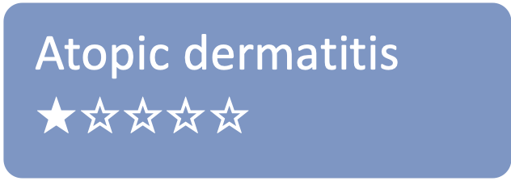
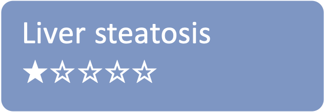
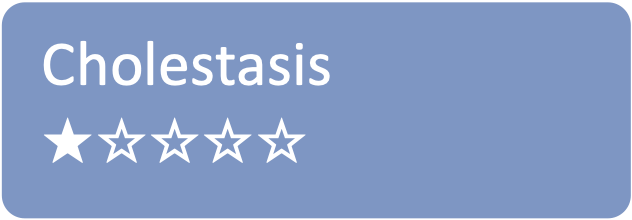
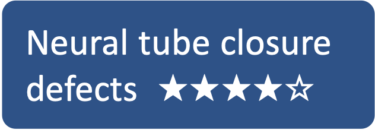
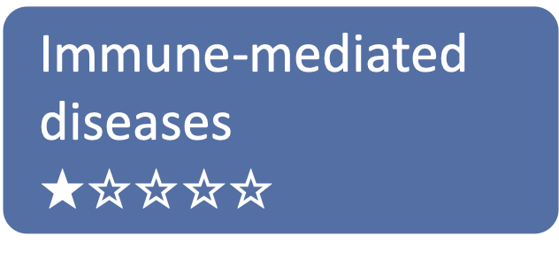
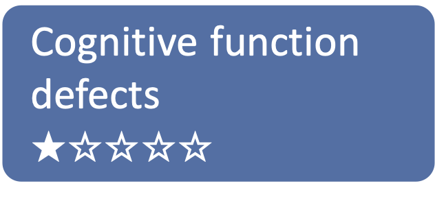
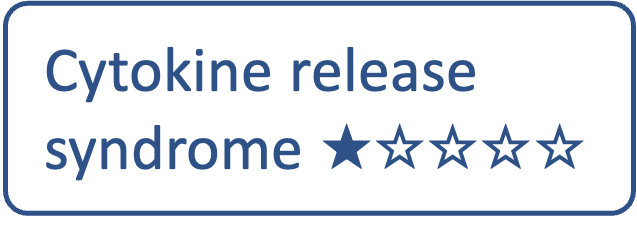

# Projects

&nbsp;&nbsp; [Disease maps for specific diseases](#disease-maps-for-specific-diseases)  
&nbsp;&nbsp; [Cross-disease projects](#cross-disease-projects)  
&nbsp;&nbsp; [Adverse outcome maps for immunotoxicology](#adverse-outcome-maps-for-immunotoxicology)  
        
The Disease Maps Community consolidates efforts focused on describing disease mechanisms. We aim to progress together through advancing technological solutions, sharing resources and best practices. New contributors are very welcome: please propose a new disease map or join one of the existing projects. Project progress status:

<table>
<tr style="height: 20px;">
<td style="width: 320px;">
&#9734;&#9734;&#9734;&#9734;&#9734; Initiated/funded 
&#9733;&#9734;&#9734;&#9734;&#9734; Active development 
&#9733;&#9733;&#9734;&#9734;&#9734; Available for exploration online 
</td>
<td style="width: 0px;"> </td>
<td style="width: 320px;"> 
&#9733;&#9733;&#9733;&#9734;&#9734; Published 
&#9733;&#9733;&#9733;&#9733;&#9734; Maintained and improved   
&#9733;&#9733;&#9733;&#9733;&#9733; Applications demonstrated
</td>
</tr>
</table>

### Disease maps for specific diseases

This section lists projects focused on specific diseases. The list is organised according to the progress status of the projects.

[COVID-19](#COVID-19), [Parkinson's disease](#Parkinsons), [cancer](#Cancer), [rheumatoid arthritis](#Rheumatoidarthritis), [asthma](#Asthma), [sarcopenia](#Sarcopenia), [cystic fibrosis](#Cysticfibrosis), [heart failure](#Heartfailure), [atherosclerosis](#Atherosclerosis), [osteoarthritis](#Osteoarthritis), [Sjogren’s syndrome](#Sjogrens), [diabetic kidney disease](#Diabetickidneydisease), [atopic dermatitis](#Atopicdermatitis), [psoriasis](#Psoriasis), [liver steatosis](#Steatosis), [cholestasis](#Cholestasis)

<table>

<tr>
<td style="width: 160px; font-size:15px;"> 
 
</td>
<td style="font-size:13px;"> 
Resource: <a href="https://covid19map.elixir-luxembourg.org/" target="_blank">COVID-19 Disease Map</a> 
Contact: Marek Ostaszewski, University of Luxembourg, Belvaux, Luxembourg 
Publications: <a href="https://www.ncbi.nlm.nih.gov/pubmed/?term=34664389+32371892" target="_blank">PubMed</a>
</td>
</tr>

<tr>
<td style="width: 160px; font-size:15px;"> 
 
</td>
<td style="font-size:13px;"> 
Resource: <a href="https://pdmap.uni.lu/" target="_blank">Parkinson's Disease Map</a> 
Contact: Marek Ostaszewski, University of Luxembourg, Belvaux, Luxembourg 
Publications: <a href="https://www.ncbi.nlm.nih.gov/pubmed/23832570" target="_blank">PubMed</a>
</td>
</tr>

<tr>
<td style="width: 160px; font-size:15px;"> 

</td>
<td style="font-size:13px;"> 
Resource: <a href="https://acsn.curie.fr/ACSN2/ACSN2.html" target="_blank">Atlas of Cancer Signalling Network</a> 
Contact: Inna Kuperstein, Institut Curie, Paris, France 
Publications: <a href="https://www.ncbi.nlm.nih.gov/pubmed/?term=32316560+26192618+29688383+29726961+25295490+27559053+25688112" target="_blank">PubMed</a>
</td>
</tr>

<tr>
<td style="width: 160px; font-size:15px;"> 

</td>
<td style="font-size:13px;"> 
Resource: <a href="https://ramap.uni.lu/minerva/" target="_blank">Rheumatoid Arthritis Map</a> 
Contact: Anna Niarakis, Paul Sabatier University - Toulouse III, Toulouse, France 
Publications: <a href="https://doi.org/10.3389/fsysb.2022.925791" target="_blank">DOI</a>
</td>
</tr>

<tr>
<td style="width: 160px; font-size:15px;"> 

</td>
<td style="font-size:13px;"> 
Resource: <a href="http://asthma-map.org/" target="_blank">AsthmaMap</a> 
Contact: Alexander Mazein, University of Luxembourg, Belvaux, Luxembourg 
Publications: <a href="https://www.ncbi.nlm.nih.gov/pubmed/30133857" target="_blank">PubMed</a>
</td>
</tr>

<tr>
<td style="width: 160px; font-size:15px;">  

</td>
<td style="font-size:13px;"> 
Resource: <a href="https://www.sbi.uni-rostock.de/research/projects/detail/73" target="_blank">Sarcopenia Map</a> 
Contact: Matti Hoch, University of Rostock, Rostock, Germany 
Publications: <a href="https://www.ncbi.nlm.nih.gov/pubmed/36407505" target="_blank">PubMed</a>
</td>
</tr>

<tr>
<td style="width: 160px; font-size:15px;"> 

</td>
<td style="font-size:13px;"> 
Resource: <a href="https://cysticfibrosismap.github.io/" target="_blank">CyFi-MAP</a> 
Contact: Catarina Pereira, University of Lisbon, Lisbon, Portugal 
Publications: <a href="https://www.ncbi.nlm.nih.gov/pubmed/34782688" target="_blank">PubMed</a>
</td>
</tr>

<tr>
<td style="width: 160px; font-size:15px;"> 

</td>
<td style="font-size:13px;"> 
Resource: <a href="https://cardiomap.elixir-luxembourg.org/" target="_blank">CardioMap</a> 
Contact: Nikolaus Berndt, Charité – Universitätsmedizin Berlin; Irina Balaur, University of Luxembourg | Publications: <a href="https://pubmed.ncbi.nlm.nih.gov/34762513/" target="_blank">PubMed</a>
</td>
</tr>

<tr>
<td style="width: 160px; font-size:15px;"> 

</td>
<td style="font-size:13px;"> 
Resource: Atherosclerosis Map 
Contact: Steven Watterson, Ulster University, Derry, Northern Ireland, UK 
Publications: <a href="https://www.ncbi.nlm.nih.gov/pubmed/30520978" target="_blank">PubMed</a> | 
Model: <a href="https://www.ebi.ac.uk/biomodels/MODEL1812100001#Overview" target="_blank">BioModels</a>
</td>
</tr>

<tr>
<td style="width: 160px; font-size:15px;"> 

</td>
<td style="font-size:13px;"> 
Resource: KneePainMap 
Contact: Bernd Seilheimer, Heel GmbH, Germany 
 
</td>
</tr>

<tr>
<td style="width: 160px; font-size:15px;"> 

</td>
<td style="font-size:13px;"> 
Resource: Sjogren Map 
Contact: Sacha E Silva-Saffar, University of Evry, University of Paris-Saclay, France 
 
</td>
</tr>

<tr>
<td style="width: 160px; font-size:15px;"> 

</td>
<td style="font-size:13px;"> 
Resource: Diabetic Kidney Disease Map 
Contact: Farnoush Kiyanpour, Isfahan University of Medical Sciences, Iran 
 
</td>
</tr>

<tr>
<td style="width: 160px; font-size:15px;"> 

</td>
<td style="font-size:13px;"> 
Resource: Atopic Dermatitis Map 
Contact: Marcio Luis Acencio, University of Luxembourg, Belvaux, Luxembourg 
 
</td>
</tr>

<tr>
<td style="width: 160px; font-size:15px;"> 

</td>
<td style="font-size:13px;"> 
Resource: Psoriasis Map 
Contact: Marcio Luis Acencio, University of Luxembourg, Belvaux, Luxembourg 
 
</td>
</tr>

<tr>
<td style="width: 160px; font-size:15px;"> 

</td>
<td style="font-size:13px;"> 
Resource: Liver Lipid Metabolism Physiological Map 
Contact: Luiz Ladeira, University of Liège, Liège, Belgium 
 
</td>
</tr>

<tr>
<td style="width: 160px; font-size:15px;"> 

</td>
<td style="font-size:13px;"> 
Resource: Liver Bile Secretion Physiological Map 
Contact: Luiz Ladeira, University of Liège, Liège, Belgium 
 
</td>
</tr>

</table>

### Cross-disease projects

This section includes projects that focus on shared mechanisms of two or more diseases, interactions between two or more diseases, or broader aspects applicable to many diseases.

<table>

<tr>
<td style="width: 160px; font-size:15px;"> 

</td>
<td style="font-size:13px;"> 
Resource: <a href="https://air.bio.informatik.uni-rostock.de/" target="_blank">Atlas of Inflammation Resolution</a> 
Contact: Matti Hoch, University of Rostock, Rostock, Germany 
Publications: <a href="https://www.ncbi.nlm.nih.gov/pubmed/?term=32893032+35473910+36973809" target="_blank">PubMed</a>
</td>
</tr>

<tr>
<td style="width: 160px; font-size:15px;"> 

</td>
<td style="font-size:13px;"> 
Resource: <a href="https://ontox.elixir-luxembourg.org/minerva/index.xhtml?id=Neural_Tube_Closure_PM_v1" target="_blank">Neural Tube Closure Physiological Map</a> 
Contact: Alessio Gamba, University of Liège, Liège, Belgium 
Publications: <a href="https://pubmed.ncbi.nlm.nih.gov/32926990/" target="_blank">PubMed</a>
</td>
</tr>

<tr>
<td style="width: 160px; font-size:15px;"> 

</td>
<td style="font-size:13px;"> 
Resource: <a href="https://syscid.elixir-luxembourg.org/minerva/" target="_blank">SYSCID Map</a> 
Diseases: IBD, rheumatoid arthritis and systemic lupus erythematosus 
Contact: Marcio Luis Acencio, University of Luxembourg, Belvaux, Luxembourg 
Publications: <a href="https://doi.org/10.3389/fimmu.2023.1257321" target="_blank">DOI</a>
</td>
</tr>

<tr>
<td style="width: 160px; font-size:15px;"> 

</td>
<td style="font-size:13px;"> 
Resource: ImmUniverse Map 
Diseases: ulcerative colitis, atopic dermatitis 
Contact: Marcio Luis Acencio, University of Luxembourg, Belvaux, Luxembourg
</td>
</tr>

<tr>
<td style="width: 160px; font-size:15px;"> 

</td>
<td style="font-size:13px;"> 
Resource: Nephron Physiological Map 
Diseases: kidney crystallopathy, tubular necrosis 
Contact: Alessio Gamba, University of Liège, Liège, Belgium
</td>
</tr>

<tr>
<td style="width: 160px; font-size:15px;"> 

</td>
<td style="font-size:13px;"> 
Resource: Brain Development Physiological Map 
Contact: Luiz Ladeira, University of Liège, Liège, Belgium
</td>
</tr>

</table>

### Adverse outcome maps for immunotoxicology

This section includes maps that describe mechanisms of adverse effects of various treatments and are based on the adverse outcome pathway (AOP) concept in toxicology.  

<table>

<tr>
<td style="width: 160px; font-size:15px;"> 

</td>
<td style="font-size:13px;"> 
Resource: CAR T cell AOP Map 
Contact: Alexander Mazein, University of Luxembourg, Belvaux, Luxembourg 
Publications: <a href="https://doi.org/10.1101/2023.03.21.533620" target="_blank">Preprint</a>
</td>
</tr>

<tr>
<td style="width: 160px; font-size:15px;"> 

</td>
<td style="font-size:13px;"> 
Resource: Cytokine Release Syndrome Map 
Contact: Alexander Mazein, University of Luxembourg, Belvaux, Luxembourg
</td>
</tr>

</table>
