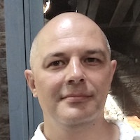
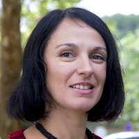

# Projects
        
The Disease Maps Project consolidates efforts focused on describing disease mechanisms. We aim to progress together through advancing technological solutions, sharing resources and best practices. New contributors are very welcome: please propose a new disease map or join one of the existing projects.  

The growing number of active projects within the Disease Maps Community are led by reasearch groups in Luxembourg, France, Germany, Portugal, Spain, the United Kingdom, the United States, Egypt, with more centers and countries involved via the corresponding networks of domain experts.  

The list of active projects, starting with published maps:

<table>
<tr style="height: 200px;">
<td style="width: 360px; text-align: left; vertical-align: top; background-color: #c3cfe0;">

</td>
<td style="width: 10px;"> </td>
<td style="width: 360px; text-align: left; vertical-align: top; background-color: #c3cfe0;">

</td>
</tr>
<tr style="height: 20px;">
<td style="width: 360px;"> </td>
<td style="width: 20px;"> </td>
<td style="width: 360px;"> </td>
</tr>
<tr style="height: 200px;">
<td style="width: 360px; text-align: left; vertical-align: top; background-color: #c3cfe0;"><strong>Alexander Mazein, PhD</strong>
Researcher, Luxembourg Centre for Systems Biomedicine, University of Luxembourg, Belvaux, Luxembourg
</td>
<td style="width: 10px;"> </td>
<td style="width: 360px; text-align: left; vertical-align: top; background-color: #c3cfe0;"><strong>Inna Kuperstein, PhD</strong>
ACSN Project Coordinator, Computational Systems Biology of Cancer group, Institut Curie, Paris, France
</td>
</tr>
</table>    

<ul style="list-style-type:none; line-height:175%;">
<li><a href="/parkinsons">Parkinson's disease</a></li>
<li><a href="/cancer">Cancer</a></li>
<li><a href="/rheumatoidarthritis">Rheumatoid arthritis</a></li>
<li><a href="/asthma">Asthma</a></li>
<li><a href="/cysticfibrosis">Cystic fibrosis</a></li>
<li><a href="/multiplesclerosis">Multiple sclerosis</a></li>
<li><a href="/atherosclerosis">Atherosclerosis</a></li>
<li><a href="/acutekidneyinjury">Acute kidney injury</a></li>
<li><a href="/adultneurogenesis">Adult neurogenesis</a></li>
<li><a href="/anaphylaxis">Anaphylaxis</a></li>
<li><a href="/duchenne">Duchenne muscular dystrophy</a></li>
<li><a href="/menieres">Meniere’s disease</a></li>
<li><a href="/spinalcordinjury">Spinal cord injury</a></li>
<li><a href="/lungcancer">Lung cancer</a></li>
<!--<li><a href="/coronaryarterydisease">Coronary artery disease</a></li>-->
</ul>

New projects being discussed:  

<ul style="list-style-type:none; line-height:175%;">
<li>Allergic rhinitis</li>
<li>Atopic dermatitis</li>
<li>Autoimmune thrombotic thrombocytopenic purpura</li>
<li>Chronic liver disease</li>
<li>Chronic lymphocytic leukaemia</li>
<li>Chronic obstructive pulmonary disease</li>
<li>Diabetes mellitus type 2</li>
<li>Immune system diseases</li>
<li>Infectious diseases</li>
<li>Inflammatory bowel disease</li>
</ul>

### [Acute kidney injury](acutekidneyinjury)

_Resource:_ The regulatory network of systemic and renal hemodynamics  
_Contact:_ Francisco J. López-Hernández, University of Salamanca, Salamanca, Spain  

### [Adult neurogenesis](adultneurogenesis)

_Resource:_ The Cognitive Resilience Map  
_Contact:_ Rupert Overall, German Center for Neurodegenerative Diseases, Dresden, Germany  

### [Anaphylaxis](anaphylaxis)

_Resource:_ Anaphylaxis Map  
_Contact:_ Feng He, Luxembourg Institute of Health, Luxembourg, Luxembourg  

### [Asthma](asthma)

_Resource:_ [AsthmaMap](http://asthma-map.org/)  
_Contact:_ Alexander Mazein, European Institute for Systems Biology and Medicine, Lyon, France  

### [Atherosclerosis](atherosclerosis)

_Resource:_ Atherosclerosis Map  
_Contact:_ Steven Watterson, University of Ulster, Coleraine, UK  

### [Cancer](cancer)

_Resource:_ [Atlas of Cancer Signalling Network](https://acsn.curie.fr/navicell/maps/acsn/master/index.html)  
_Contact:_ Inna Kuperstein, Institut Curie, Paris, France  

<!--### [Coronary artery disease](coronaryarterydisease)
_Resource:_ Coronary Artery Disease Map  
_Contact:_ Daniela Börnigen, University Medical Center Hamburg-Eppendorf, Hamburg, Germany-->  

### [Cystic fibrosis](cysticfibrosis)

_Resource:_ Cystic Fibrosis Map  
_Contact:_ Catarina Pereira, University of Lisbon, Lisbon, Portugal  

### [Duchenne muscular dystrophy](duchenne)

_Resource:_ Duchenne Muscular Dystrophy Map  
_Contact:_ Cecilia Jimenez-Mallebrera, Hospital Sant Joan de Déu, Barcelona, Spain  

### [Lung cancer](lungcancer)

_Resource:_ Lung Cancer Disease Map  
_Contact:_ Nathanaël Lemonnier, Institute for Advanced Biosciences, Grenoble, France  

### [Meniere’s disease](menieres)

_Resource:_ Meniere’s Disease Map  
_Contact:_ Jose Antonio Lopez-Escamez, Instituto Biosanitario Granada, Genyo, Granada, Spain  

### [Multiple sclerosis](multiplesclerosis)

_Resource:_ Multiple Sclerosis Pathways Map  
_Contact:_ Julio Saez-Rodriguez, RWTH-Aachen University Hospital, Aachen, Germany  

### [Parkinson's disease](parkinsons)

_Resource:_ [Parkinson's Disease Map](https://pdmap.uni.lu/MapViewer/)  
_Contact:_ Stephan Gebel, University of Luxembourg, Belval, Luxembourg  

### [Rheumatoid arthritis](rheumatoidarthritis)

_Resource:_ Rheumatoid Arthritis Map  
_Contact:_ Anna Niarakis, University of Evry Val d’Essonne, Evry, France  

### [Spinal cord injury](spinalcordinjury)

_Resource:_ Spinal Cord Injury Map  
_Contact:_ Ahmed AlBayar, Perelman School of Medicine, University of Pennsylvania, Philadelphia, USA
