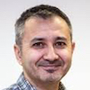
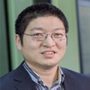
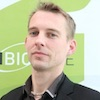
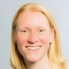

# Team

This page defines the organisational structure, roles and processes in the  Disease Maps Project, acknowledges contributions and reflects the history of the project development.

### Founders

[Rudi Balling](#RudiBalling), [Charles Auffray](#CharlesAuffray), [Alexander Mazein](#AlexanderMazein), [Marek Ostaszewski](#MarekOstaszewski), [Steven Watterson](#StevenWatterson), [Inna Kuperstein](#InnaKuperstein), [Andrei Zinovyev](#AndreiZinovyev)  

### Project Leaders

[Alexander Mazein](#AlexanderMazein), [Marek Ostaszewski](#MarekOstaszewski), [Inna Kuperstein](#InnaKuperstein)  

### Disease Maps Scientific Committee

[Charles Auffray](#CharlesAuffray), [Reinhard Schneider](#ReinhardSchneider), [Emmanuel Barillot](#EmmanuelBarillot), [Rudi Balling](#RudiBalling), [Andrei Zinovyev](#AndreiZinovyev)  

### Project Coordinators

[Alexander Mazein](#AlexanderMazein), [Marek Ostaszewski](#MarekOstaszewski), [Inna Kuperstein](#InnaKuperstein), [Andrei Zinovyev](#AndreiZinovyev), [Reinhard Schneider](#ReinhardSchneider), [Emmanuel Barillot](#EmmanuelBarillot), [Rudi Balling](#RudiBalling), [Charles Auffray](#CharlesAuffray)   

### Disease Maps Project Team

[Alexander Mazein](#AlexanderMazein), [Marek Ostaszewski](#MarekOstaszewski), [Inna Kuperstein](#InnaKuperstein), [Charles Auffray](#CharlesAuffray), [Rudi Balling](#RudiBalling), [Reinhard Schneider](#ReinhardSchneider), [Emmanuel Barillot](#EmmanuelBarillot), [Andrei Zinovyev](#AndreiZinovyev), [Steven Watterson](#StevenWatterson), [Catarina Pereira](#CatarinaPereira), [Andre Falcao](#AndreFalcao), [Anna Niarakis](#AnnaNiarakis), [Feng He](#FengHe), [Francisco J. Lopez Hernandez](#FranciscoJLopezHernandez), [Julio Saez Rodriguez](#JulioSaezRodriguez), [Nathanaël Lemonnier](#NathanaelLemonnier), [Daniela Börnigen](#DanielaBornigen), Cecilia Jimenez Mallebrera, Susana Kalko, Rupert Overall, Jose Antonio Lopez-Escamez, [Ugur Dogrusoz](#UgurDogrusoz), Irina Balaur, Bertrand De Meulder, Jan Hasenauer, Joaquin Dopazo  

{:width="105px"} | <a id="AlexanderMazein"><strong>Alexander Mazein</strong></a> Co-founder of the Disease Maps Project Leader of the Disease Maps Project  
{:width="105px"} | <a id="MarekOstaszewski"><strong>Marek Ostaszewski</strong></a> Co-founder of the Disease Maps Project Co-leader of the Disease Maps Project Researcher at the Luxembourg Centre for Systems Biomedicine, Luxembourg
{:width="105px"} | <a id="InnaKuperstein"><strong>Inna Kuperstein</strong></a> Co-founder of the Disease Maps Project Co-leader of the Disease Maps Project Coordinator of the Atlas of Cancer Signalling Networks Senior Research Scientist at the Institut Curie, France
{:width="105px"} | <a id="CharlesAuffray"><strong>Charles Auffray</strong></a> Co-founder of the Disease Maps Project PI of the Disease Maps Project Founding Director of the European Institute for Systems Biology and Medicine,  France
{:width="105px"} | <a id="RudiBalling"><strong>Rudi Balling</strong></a> Co-founder of the Disease Maps Project Director of the Luxembourg Centre for Systems Biomedicine, Luxembourg
{:width="105px"} | <a id="ReinhardSchneider"><strong>Reinhard Schneider</strong></a> PI of the Disease Maps Project Head of Bioinformatics Core, Luxembourg Centre for Systems Biomedicine, Luxembourg
{:width="105px"} | <a id="EmmanuelBarillot"><strong>Emmanuel Barillot</strong></a> PI of the Disease Maps Project Director of the U900 Institut Curie/INSERM/Ecole des Mines ParisTech, France
{:width="105px"} | <a id="AndreiZinovyev"><strong>Andrei Zinovyev</strong></a> Co-founder of the Disease Maps Project Scientific Coordinator of the Computational Systems Biology of Cancer group at the Institut Curie, France
{:width="105px"} | <a id="StevenWatterson"><strong>Steven Watterson</strong></a> Co-founder of the Disease Maps Project Lecturer in Computational Biology (Hypertension), Northern Ireland Centre  for Stratified Medicine, University of Ulster, UK  

<table>
<tr>
<td style="width: 100px;"></td>
<td><strong>Ugur Dogrusoz</strong>
PI of the Newt Editor project Professor in Computer Engineering at the Bilkent University, Turekey
</td>
</tr>
<tr>
<td style="width: 100px;"></td>
<td><strong>Catarina Pereira</strong>
Leader of the Cystic Fibrosis Map project (CF-MAP) PhD Student at the University of Lisbon, Portugal
</td>
</tr>
<tr>
<td style="width: 100px;"></td>
<td><strong>Andre Falcao</strong>
PI of the Cystic Fibrosis Map project (CF-MAP) Assistant Professor, Department of Informatics, University of Lisbon, Portugal
</td>
</tr>
<tr>
<td style="width: 100px;"></td>
<td><strong>Anna Niarakis</strong>
PI of the Rheumatoid Arthritis Map project Associate Professor, University of Evry Val d’Essonne, France
</td>
</tr>
<tr>
<td style="width: 100px;"></td>
<td><strong>Feng He</strong>
Coordinator of the Anaphylaxis Map project Head of Immune Systems Biology Group, Department of Infection and Immunity, Luxembourg Institute of Health, Luxembourg
</td>
</tr>
<tr>
<td style="width: 100px;"></td>
<td><strong>Francisco J. Lopez Hernandez</strong>
Coordinator of the Regulatory Network of Systemic and Renal Hemodynamics project Group Leader, Senior Researcher and Assistant Professor, Salamanca Biomedical Research Institute & University of Salamanca, Spain
</td>
</tr>
<tr>
<td style="width: 100px;"></td>
<td><strong>Julio Saez Rodriguez</strong>
Coordinator of the Multiple Sclerosis Pathways Map project; Professor of Computational Biomedicine at the Faculty of Medicine, RWTH-Aachen University Hospital, Aachen, Germany; Visiting Group Leader at the European Bioinformatics Institute - EMBL-EBI, UK
</td>
</tr>
<tr>
<td style="width: 100px;"></td>
<td><strong>Nathanaël Lemonnier</strong>
Coordinator of the Lung Cancer Disease Map (LCDMap) project Systems Biology Research Associate, Institute for Advanced Biosciences, France
</td>
</tr>
<tr>
<td style="width: 100px;"></td>
<td><strong>Daniela Börnigen</strong>
Coordinator of the Coronary Artery Disease Map project Senior Researcher, Department of General and Interventional Cardology, University Heart Center Hamburg GmbH (UHZ), University Medical Center Hamburg-Eppendorf, Germany
</td>
</tr>
</table>

