# Team

This page defines the organisational structure, roles and processes in the  Disease Maps Project, acknowledges contributions and reflects the history of the project development.

### Project Leaders

[Alexander Mazein](#AlexanderMazein), [Marek Ostaszewski](#MarekOstaszewski), [Inna Kuperstein](#InnaKuperstein), [Anna Niarakis](#AnnaNiarakis)  

### Principal Investigators

[Charles Auffray](#CharlesAuffray), [Reinhard Schneider](#ReinhardSchneider), [Emmanuel Barillot](#EmmanuelBarillot) 

### Project Coordinators

[Alexander Mazein](#AlexanderMazein), [Marek Ostaszewski](#MarekOstaszewski), [Inna Kuperstein](#InnaKuperstein), [Anna Niarakis](#AnnaNiarakis), [Andrei Zinovyev](#AndreiZinovyev), [Reinhard Schneider](#ReinhardSchneider), [Emmanuel Barillot](#EmmanuelBarillot), [Rudi Balling](#RudiBalling), [Charles Auffray](#CharlesAuffray)  

### Disease Maps Project Team

[Alexander Mazein](#AlexanderMazein), [Marek Ostaszewski](#MarekOstaszewski), [Inna Kuperstein](#InnaKuperstein), [Anna Niarakis](#AnnaNiarakis), [Charles Auffray](#CharlesAuffray), [Rudi Balling](#RudiBalling), [Reinhard Schneider](#ReinhardSchneider), [Emmanuel Barillot](#EmmanuelBarillot), [Andrei Zinovyev](#AndreiZinovyev), [Steven Watterson](#StevenWatterson), [Ugur Dogrusoz](#UgurDogrusoz), [Jan Hasenauer](#JanHasenauer), [Catarina Pereira](#CatarinaPereira), [Andre Falcao](#AndreFalcao), [Feng He](#FengHe), [Francisco J. Lopez Hernandez](#FranciscoJLopezHernandez), [Julio Saez Rodriguez](#JulioSaezRodriguez), [Nathanaël Lemonnier](#NathanaelLemonnier), [Cecilia Jimenez Mallebrera](#CeciliaJimenezMallebrera), [Rupert Overall](#RupertOverall), [Jose Antonio Lopez-Escamez](#JoseAntonioLopezEscamez), [Irina Balaur](#IrinaBalaur), [Bertrand De Meulder](#BertrandDeMeulder), [Joaquin Dopazo](#JoaquinDopazo), [Matti Hoch](#MattiHoch)  

<table>
<tr>
<td style="width: 110px;"><a id="AlexanderMazein">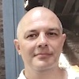</a></td>
<td><strong>Alexander Mazein</strong>
Co-founder of the Disease Maps Project; Leader of the Disease Maps Project; Researcher at the Luxembourg Centre for Systems Biomedicine, University of Luxembourg, Luxembourg
</td>
</tr>
<tr>
<td style="width: 110px;"><a id="MarekOstaszewski">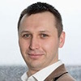</a></td>
<td><strong>Marek Ostaszewski</strong>
Co-founder of the Disease Maps Project; Leader of the Disease Maps Project; Researcher at the Luxembourg Centre for Systems Biomedicine, University of Luxembourg, Luxembourg
</td>
</tr>
<tr>
<td style="width: 110px;"><a id="InnaKuperstein">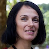</a></td>
<td><strong>Inna Kuperstein</strong>
Co-founder of the Disease Maps Project; Leader of the Disease Maps Project; Organiser of the DMCM2018 in Paris; Coordinator of the Atlas of Cancer Signalling Networks; Senior Research Scientist at the Institut Curie, France
</td>
</tr>
<tr>
<td style="width: 110px;"></td>
<td><strong>Anna Niarakis</strong>
Leader of the Disease Maps Project; PI of the Rheumatoid Arthritis Map project;  Associate Professor, University of Evry, University of Paris-Saclay, Evry, France
</td>
</tr>
<tr>
<td style="width: 110px;"><a id="CharlesAuffray">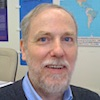</a></td>
<td><strong>Charles Auffray</strong>
Co-founder of the Disease Maps Project; PI of the Disease Maps Project;  Founding Director of the European Institute for Systems Biology and Medicine, France
</td>
</tr>
<tr>
<td style="width: 110px;"><a id="RudiBalling">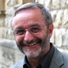</a></td>
<td><strong>Rudi Balling</strong>
Co-founder of the Disease Maps Project;  Director of the Luxembourg Centre for Systems Biomedicine, University of Luxembourg, Luxembourg
</td>
</tr>
<tr>
<td style="width: 110px;"></td>
<td><strong>Reinhard Schneider</strong>
PI of the Disease Maps Project; Full professor / Chief Scientist 1 in Bioinformatics, Head of Bioinformatics Core Facility, Luxembourg Centre for Systems Biomedicine, University of Luxembourg, Luxembourg
</td>
</tr>
<tr>
<td style="width: 110px;"><a id="EmmanuelBarillot">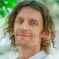</a></td>
<td><strong>Emmanuel Barillot</strong>
PI of the Disease Maps Project;  Director of the U900 Institut Curie/INSERM/Ecole des Mines ParisTech, France
</td>
</tr>
<tr>
<td style="width: 110px;"><a id="AndreiZinovyev">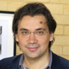</a></td>
<td><strong>Andrei Zinovyev</strong>
Co-founder of the Disease Maps Project;  Scientific Coordinator of the Computational Systems Biology of Cancer group at the Institut Curie, France
</td>
</tr>
<tr>
<td style="width: 110px;"><a id="StevenWatterson">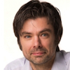</a></td>
<td><strong>Steven Watterson</strong>
Coordinator of the Atherosclerosis Map project; Lecturer in Computational Biology (Hypertension), Northern Ireland Centre for Stratified Medicine, University of Ulster, UK
</td>
</tr>
<tr>
<td style="width: 110px;"></td>
<td><strong>Ugur Dogrusoz</strong>
PI of the Newt Editor project;  Professor in Computer Engineering at the Bilkent University, Turkey
</td>
</tr>
<tr>
<td style="width: 110px;"></td>
<td><strong>Catarina Pereira</strong>
Leader of the Cystic Fibrosis Map project (CF-MAP);  PhD Student at the University of Lisbon, Portugal
</td>
</tr>
<tr>
<td style="width: 110px;"></td>
<td><strong>Andre Falcao</strong>
PI of the Cystic Fibrosis Map project (CF-MAP);  Assistant Professor, Department of Informatics, University of Lisbon, Portugal
</td>
</tr>
<tr>
<td style="width: 110px;"></td>
<td><strong>Feng He</strong>
Coordinator of the Anaphylaxis Map project;  Head of Immune Systems Biology Group, Department of Infection and Immunity, Luxembourg Institute of Health, Luxembourg
</td>
</tr>
<tr>
<td style="width: 110px;"></td>
<td><strong>Francisco J. Lopez Hernandez</strong>
Coordinator of the Regulatory Network of Systemic and Renal Hemodynamics project; Group Leader, Senior Researcher and Assistant Professor, Salamanca Biomedical Research Institute & University of Salamanca, Spain
</td>
</tr>
<tr>
<td style="width: 110px;"></td>
<td><strong>Julio Saez Rodriguez</strong>
Coordinator of the Multiple Sclerosis Pathways Map project; Professor of Medical Bioinformatics and Data Analysis, Heidelberg University Hospital, Heidelberg, Germany
</td>
</tr>
<tr>
<td style="width: 110px;"></td>
<td><strong>Nathanaël Lemonnier</strong>
Coordinator of the Lung Cancer Disease Map (LCDMap) project;  Systems Biology Research Associate, Institute for Advanced Biosciences, France
</td>
</tr>
<tr>
<td style="width: 110px;"></td>
<td><strong>Cecilia Jimenez Mallebrera</strong>
PI of the Duchenne Muscular Dystrophy Map project;  Director, Laboratory for Translational Research into Children's Neuromuscular Diseases, Hospital Sant Joan de Déu, Barcelona, Spain
</td>
</tr>
<tr>
<td style="width: 110px;"><a id="RupertOverall">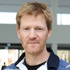</a></td>
<td><strong>Rupert Overall</strong>
PI of the Cognitive Resilience Map project (adult neurogenesis);  Platform Leader, German Center for Neurodegenerative Diseases (DZNE), Dresden, Germany
</td>
</tr>
<tr>
<td style="width: 110px;"><a id="JoseAntonioLopezEscamez">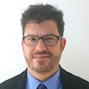</a></td>
<td><strong>Jose Antonio Lopez-Escamez</strong>
PI of the Meniere's Disease Map project;  Head of the Otology and Neurotology Group, Centre for Genomics and Oncology Genyo, Instituto Biosanitario Granada, Granada, Spain
</td>
</tr>
<tr>
<td style="width: 110px;"><a id="JanHasenauer">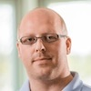</a></td>
<td><strong>Jan Hasenauer</strong>
Development of large-scale mechanistic model based on disease maps;  Professor, Interdisciplinary Research Unit Mathematics and Life Sciences, University of Bonn, Bonn, Germany; Group Leader, Institute of Computational Biology, Helmholtz Zentrum München, Munich, Germany
</td>
</tr>
<tr>
<td style="width: 110px;"><a id="IrinaBalaur">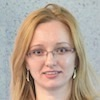</a></td>
<td><strong>Irina Balaur</strong>
Leader of the Neo4j-for-Disease-Maps initiative for the integration of the disease map resources; Lead Developer of the ySBGN tool
</td>
</tr>
<tr>
<td style="width: 110px;"></td>
<td><strong>Bertrand De Meulder</strong>
Developer of pipelines for omics data analysis and interpretation through disease maps; Researcher at the European Institute for Systems Biology and Medicine, France
</td>
</tr>
<tr>
<td style="width: 110px;"><a id="JoaquinDopazo">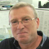</a></td>
<td><strong>Joaquin Dopazo</strong>
Modelling on the basis of disease maps; Organiser of the 4th Disease Maps Community Meeting (DMCM2019); Head of the Clinical Bioinformatics Area, FPS, Hospital Virgen del Rocio, Sevilla, Spain
</td>
</tr>
<tr>
<td style="width: 110px;"><a id="MattiHoch">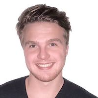</a></td>
<td><strong>Matti Hoch</strong>
Medical Biotechnology; Co-organiser of the 6th Disease Maps Community Meeting (DMCM2021); PhD Student at the Department of Systems Biology and Bioinformatics, University of Rostock, Germany
</td>
</tr>
</table>

